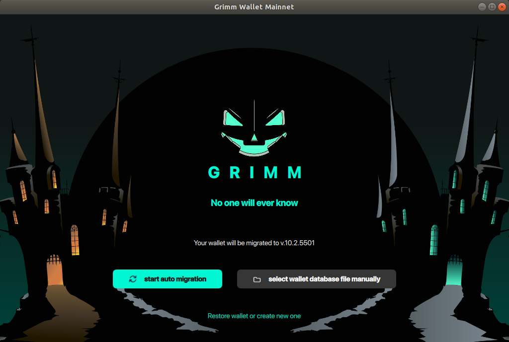
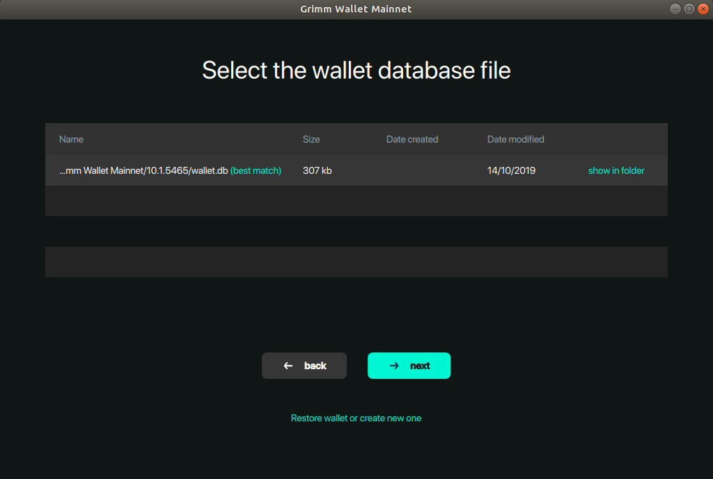
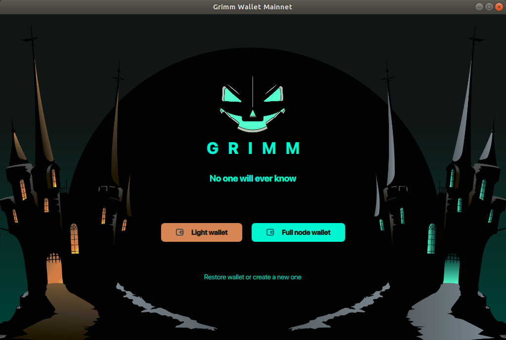

1. Backup by copying wallet.db (for safety)

   Backup your wallet by simply copying the wallet.db file to another location. 
   This file is located in the Grimm Wallet Mainnet data folder by default.
```
Windows: \Users\{your User name}\AppData\Local\Grimm Wallet Mainnet\{current ver. like 10.1.5465}\wallet.db

Mac: /Users/{your User name}/Library/Application Support/Grimm Wallet Mainnet/{current ver. like 10.1.5465}/wallet.db

Linux: /home/{your User name}/.local/share/Grimm Wallet Mainnet/{current ver. like 10.1.5465}/wallet.db
```
2. Download new release from our [website](https://grimmw.com) or from [github releases](https://github.com/freenetcoder/grimm/releases) 

3. Install and run new wallet.

4. Choose "auto migration" button to automatically update from last wallet (then click "next") or "select wallet 
database file manually" (if wallet.db stored in a non-default folder). The migration is done.





5. Choose Light wallet (remote node) or Full node wallet and enter the password.



