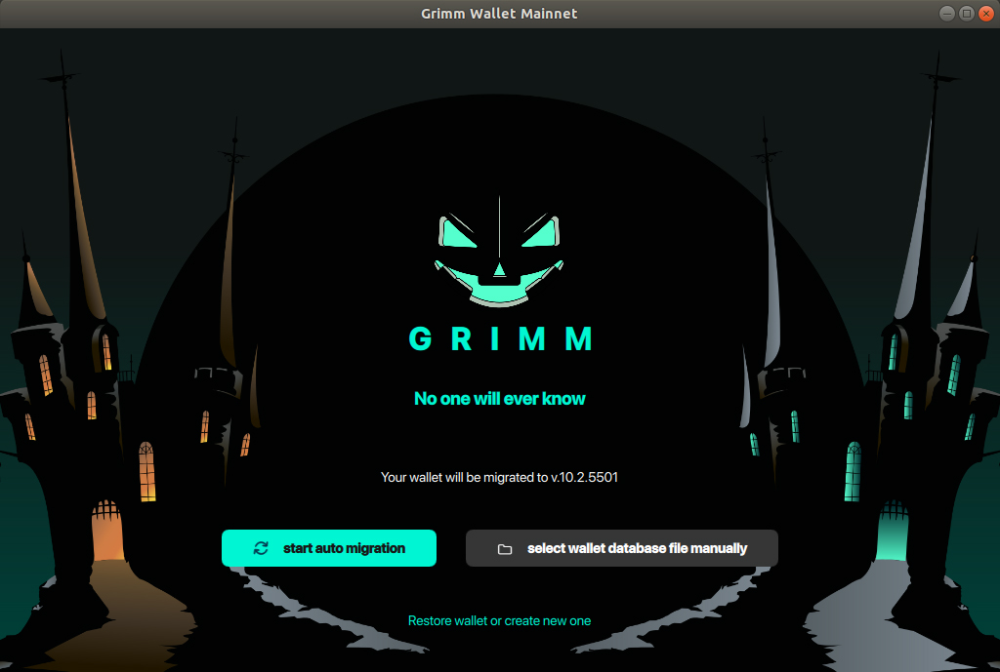
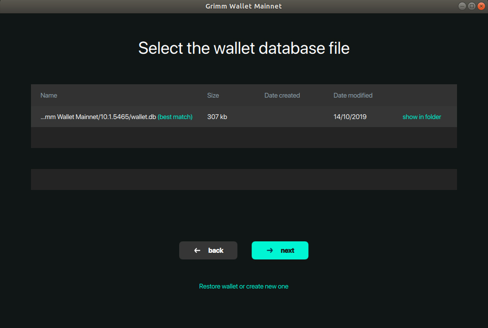
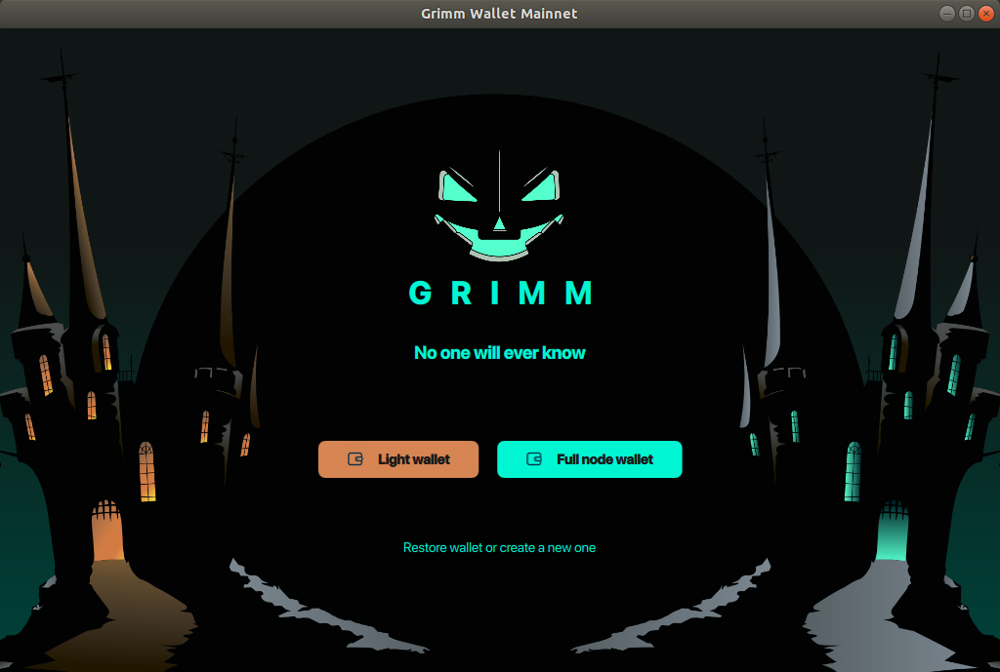

1. Сделайте бекап файла wallet.db
   Скопируйте файл wallet.db в любое другое место на вашем компьютере. Этот файл находится по следующему пути:

```
Windows: \Users\{your User name}\AppData\Local\Grimm Wallet Mainnet\{current ver. like 10.1.5465}\wallet.db

Mac: /Users/{your User name}/Library/Application Support/Grimm Wallet Mainnet/{current ver. like 10.1.5465}/wallet.db

Linux: /home/{your User name}/.local/share/Grimm Wallet Mainnet/{current ver. like 10.1.5465}/wallet.db
```
2. Загрузите кошелек с нашего [вебсайта](https://grimmw.com) или с [github, раздел релизы](https://github.com/freenetcoder/grimm/releases) 

3. Установите и запустите новый кошелек.

4. Выберете "автоматическая миграция" для автоматического обновления из последней установленной версии (затем нажмите "далее") или "выбрать файл базы данных кошелька вручную" и выберете путь к файлу (если файл wallet.db хранится в ином месте чем по дефолту). Обновление завершено.





5. Выберете режим запуска кошелька Легкий кошелек (удаленная нода) или полная нода. Затем пароль и кошелек готов к работе.



